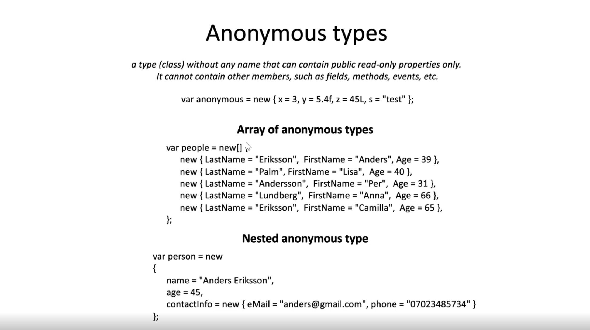

# Anonymous methods
 (En namnlös metod)


## Det gamla sättet
 ```C#
 delegate(Photo photo){return createAwesomePainting(Photo)};
 ```
 * använder delegate som funktionsnamn


## Det nya sättet (Lambda)

```C#
p => createaAwesomePainting(p);
``` 

* p är in parametern
* Har inget funktionsnamn

### Flera parametrar för lambda
```C#
(person, legalAge) => person.Age >= legalAge;
//Func<Person,int,bool>
```
### Utan parametrar Lambda
```C#
() => Console.WriteLine("Hello world!"));
```
* Måste ha paranteser innan


### Flera statements Lambda
```C#
(photo, painting) =>
{
    painting.deliveryAddress = photo.owner.address;
    return painting;
}
```
* Måste ha en return om man öppnar ett kodblock


## Anonymous Methods

# Anonymous Types

