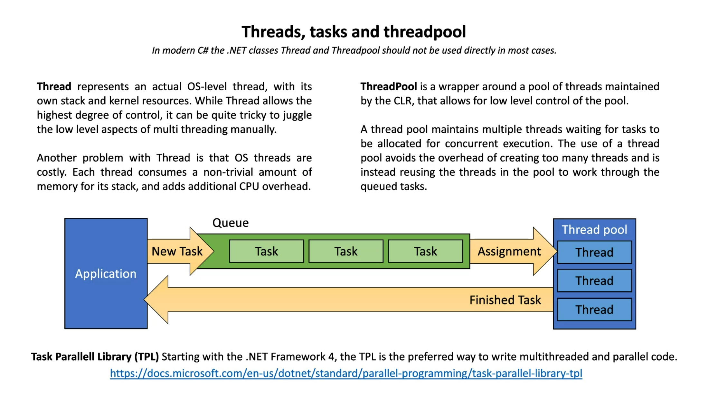
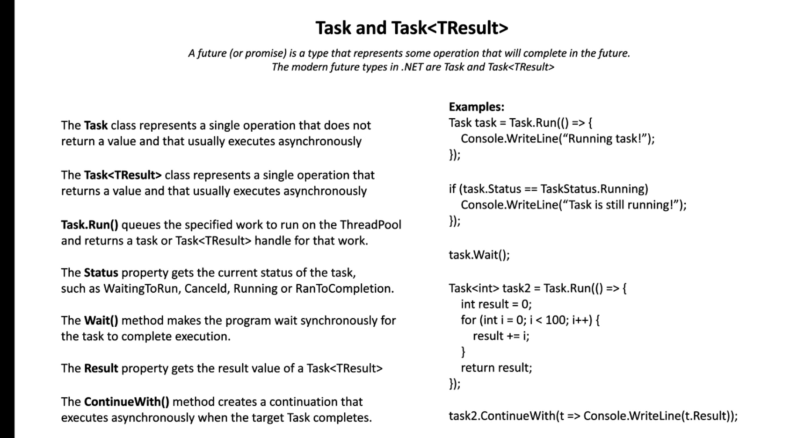
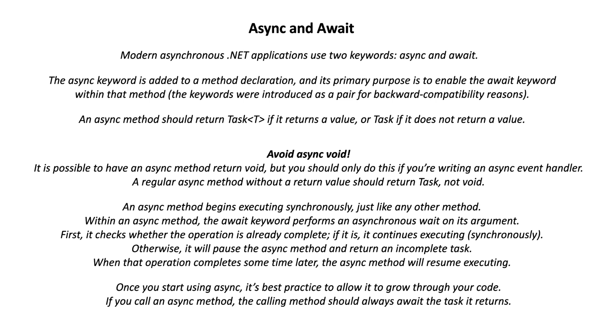
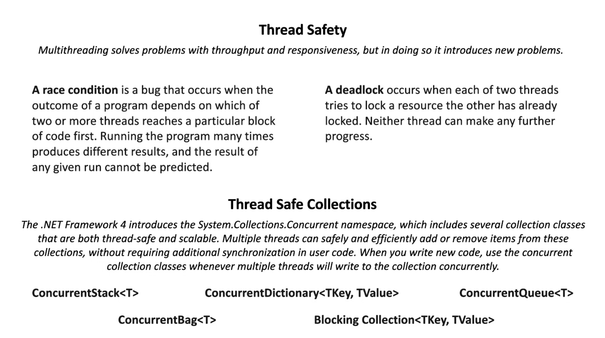

# Asynchronous && Synchronous Programming

Synkront är att allt görs i en tur ordning (är inte alltid det mest optimala sättet att programmera)

Asynkront är att man kan göra vissa tasks samtidigt som den synkrona biten körs. DVS, 2 saker görs samtidigt (eller fler) T.ex: Hämta en bild från nätet medans jag kör massa annan kod till bilden är nerladdad istället för att vänta på att bilden laddas ner.


* Concurrency, Multitasking (Delar upp arbetet på en single thread kärna, dvs om du har 2 köer, så tar den lite på ena först. Sen lite på den andra, så hoppar den fram och tillbaka. TimeSlicing.)


* Parallellism, MultiThreading (multi thread kärnor, en del av CPU läser en del kod, en annan en annan bit kod. Kod skickas till flera kärnor och utförs samtidigt.) 

* PLINQ - Är LINQ fast med parallellisering. Bättre i vissa fall att använda.
    ```C#
        // PLINQ

    var list1 = Enumerable
        .Range(0, 50)
        .AsParallel() // Bara denna biten av kod skiljer från LINQ
        .Select(i => CostlyOperation1(i))
        .ToList();
    Console.WriteLine("\nProcessing completer! Here is the processed data:\n");
    list1.ForEach(i => Console.WriteLine(i));


    static int CostlyOperation1(int n)
    {
        for (int i = 0; i < 1000_000_000; i++) ;
        
        Console.WriteLine($"Processing element: {n}");
        return n;
    }
    ```


## Multitask


## Thread




## Task


// Result and the wait function locks the thread until completion. Which might be bad sometimes and sometimes good. Wait and result is synchronous basically since the commands locks up the thread until the wait is done.

## Async Await



Koden i C# (ConsoleApp mappen) förklarar väldigt bra hur dette fungerar.

await är Asynkron. .Wait() är synkront.

Om du gör en Async, använd alltid en await. (Best practice)


## Thread safety


```C#
    object myLock = new object();
                lock (myLock) 
                { 
                }
```