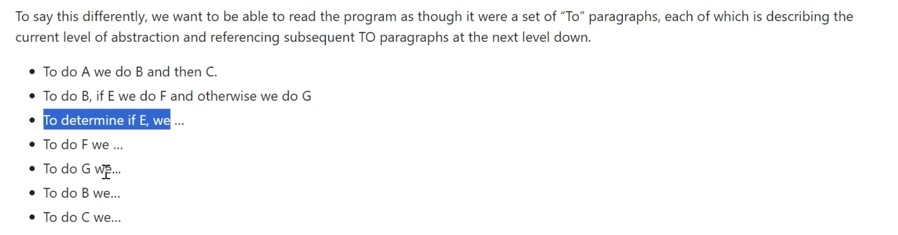
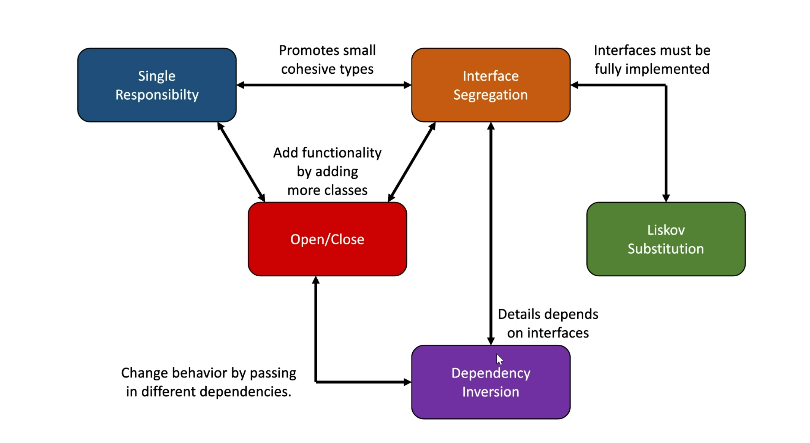
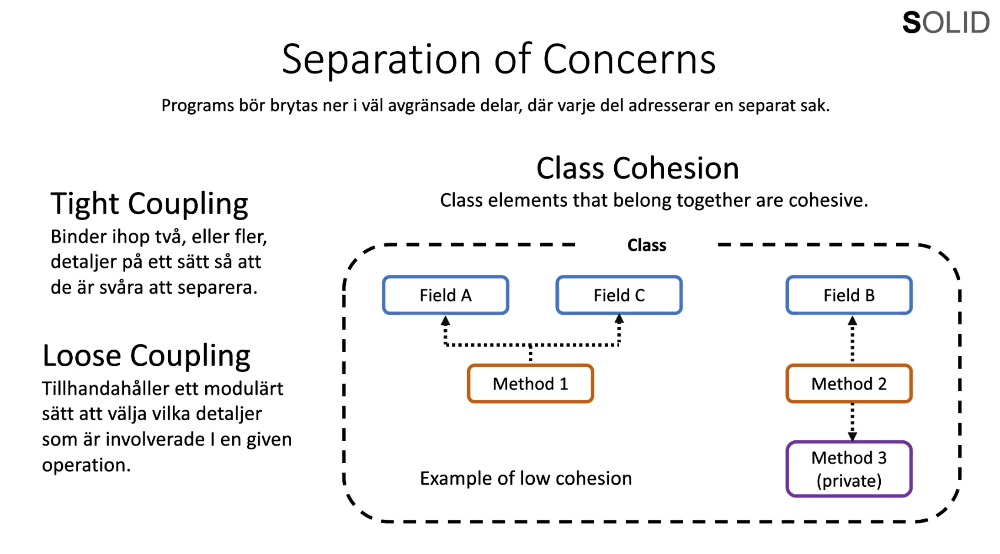
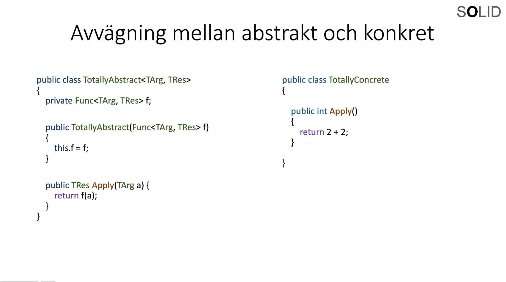

# Clean Code
Kod som är lätt att läsa.

Kod som är lätt att utöka.

Kod som kan återanvändas.

Kod som inte går sönder på oväntade ställen.


* Dont repeat yourself. (DRY)
* Tydlig kod, andra skall förstå vad du gör.
* Det skall vara självförklarande.
* Kommentarer bör endast förklara varför, inte hur.
    * Skriv om koden så att den går att förstå istället för att kommentera.

## Namn på variabler, metoder, funktioner, klasser skall vara extremt tydliga. Självförklarande i princip. Lättläst.
    
    * Beskrivande

    * Enhetligt.
    
    * Verb för namn på metoder / funktioner. t.ex GetName(); CalculateAreaForAll
    (Circle[] circles);
    
    * Substantiv för namn på variabler / objekt / class. t.ex Name;
    
    * en variabel, singular. t.ex name;

    * En array / lista / stack (collections), plural. t.ex names;

    * Ej döpa saker till ish samma, t.ex GetName() och GetNames. Unvik namn som är nästan lika.

    * Så korta och beskrivande som möjligt.

    * Namn som går att uttala
    
    * Clarity over entertainment value.

    * Namngivning av bool börjar oftast med is/are/has

### Case
* camelCase - I c# på lokala variabler och parametrar (till metoder/funktioner)
* PascalCase - I C# på allt annat, klasser/funktioner/metoder/properties
* snake_case - I Python 
* kebab-case - Används ej i C#


### Magiska nummer
```C#
int numberOfDays
int numberOfDaysPerWeek = 7;
int numberOfWeeks = 5;
if(numberOfDays / 7 (numberOfDaysPerWeek) <5 (numberOfWeeks))
{

}

```
 * Var tydlig och skriv ner allt i variabler istället för att hårdkoda variabler.


### Funktioner och metoder

 * Namn i verbform, som antyder att något utförs.
 * Funktioner / Metoder bör vara korta men beskrivande.
 * Varje metod gör bara en sak utan bieffekter.
 * Metoder bör helst ta så få parametrar som möjligt.
 
Code should read like a top-down narrative. Every method should be followed by those at the next level of abstraction so that we can read the program, descending one level of abstraction at a time as we read down the list of methods. 




## Code smell(smutsig kod)

Kod som inte är tydlig.

Kod som är onödigt komplex.

Kod som går sönder på oväntade sätt.

Kod som gör saker den inte ska.


## Design principls
* Generella riktlinjer.

* DRY - Don't repeat yourself.
* KISS - Keep it Simple, Stupid.
* YAGNI - You Ain't Gonna Need It. (Bygg inte funktionalitet i förväg. Bygg när du behöver det.)
* SOLID - Samlingsnamn för 5 designprinciper.
    * SRP,OCP,LSP,ISP,DIP.


## Design patterns
* Lösningar på specifika problem.

* Factory Pattern - Skapa ny objekt.

* Build Pattern - Konstruera komplexa objekt.

* Strategy Pattern - Tillhandahålla olika algoritmer.

* Dependancy Injection - Skapa löst knutna beroenden.


## SOLID


### Single Responsibility Principle. 
    * "A class should have only one reason to change."

    * "A method should only do one thing, with no side effects."

    * "Gather together the things that change for the same reason.
       Seperate those things that change for different reasons."
    
    * SRP handlar om att bedöma hur kod bäst brys ner i beståndsdeler och hur mand rar gränser kring inkapsling i sin kod.


### Open/Closed Principle.
    * "Software entities (classes, modules, functions) should be open for extension but closed for modication."

    * "You should be able to extend the behaviour of a system without having to modify that system."
    
    * OCP handlar om att bedöma vilka delar av ditt system som börj tilhandahålla konkret funktionalitet (som du själv implementerat) och vilka delar som är abstrakta konstruktioner där den som använder systemet själv kan lägga in konkret funktionalitet. 
c


### Liskov Substitution Principle.
    * "Methods that use references to base classes must be able to use objects of derived classes without knowing it."
    
    * "A basetype must be replaceable with any of its subtypes without breaking the functionality or logic of the program."

    * "Interfaces must be fully implemented."

    * Principen hjälper dig att undvika oväntade buggar och fel när du använder arv och polymorphism i din kod.

### Interface Segregation Principle.
    * "Clients should not be forced to depend upon methods that they do not use."

    * "Prefer small, cohesive interfaces, to large, expansive ones."

    * Problemet med stora interface är att samtliga medlemmar måste implementeras för att inte bryta mot Liskov Substitution Principle; även dem som vi egentligen inte behöver.

### Dependency Inversion Principle.

    * "High-level modules should not depend on low-level modules. Both should depend on abstractions."

    * "Abstractions should not depend on details. Details should depend on abstractions."

    * Principen hjälper dig att skapa löst kopplade beroenden och en modulär struktur, där högnivåkod inte är direkt beroende av detaljer på låg nivå.
