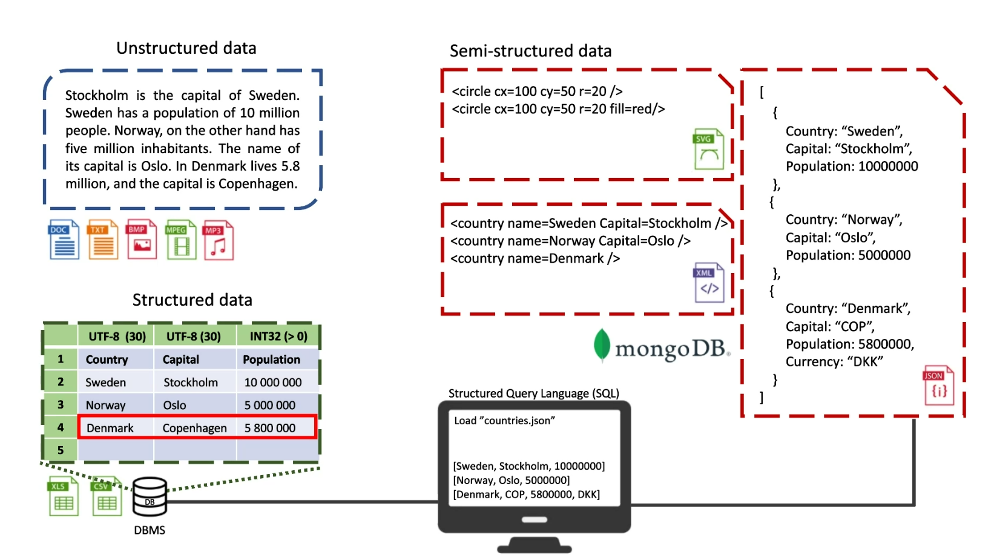

# Json

## Unstructured Data
* Word
* Text
* Bilder
* Video
* Ljud

## Structured Data
* Excel
* CSV (Comma seperated values)
* JSON 
* Database management system (sql)

## Semi Structured data
* Json
* SVG (Vector graphic)
* XML
* mongoDB

## Json
* Serialiser (Create json)
* Deserialize (Read Json)

* JsonSerializerOptions (You can set options how to write json etc in this)
    * UnmappedMemberHandling =System.Text.Json.Serialization.JsonUnmappedMemberHandling.Disallow (Raise an exception if cant find the field/variable)

    * WriteIndented = true (Write the code indented in example, Console)
    * IncludeFields = true (Includes field/variables, public ones.)
    * IgnoreReadOnlyFields = true (Ignores the readonly Fields)
    * AllowTrailingCommas = true (allows and ignores extra commas)
    * PropertyNameCaseInsensitive = true (if true, not case sensitive)
    * PropertyNamingPolicy = JsonNamingPolicy.CamelCase (Sets the naming convention to camelCase, snakeCase, kebabCase etc )

## Attribute
* [JsonIgnore] (ignore when serialising to json, can be set at field, props, methods and classes)

* [JsonPropertyName("ThiIsAStudent")] (Changes the prop name to the inserted string)
* [JsonPropertyOrder(-1)] (Sets the order where the property is in the json. -1 is top, 0 is og spot, 1 is bottom)