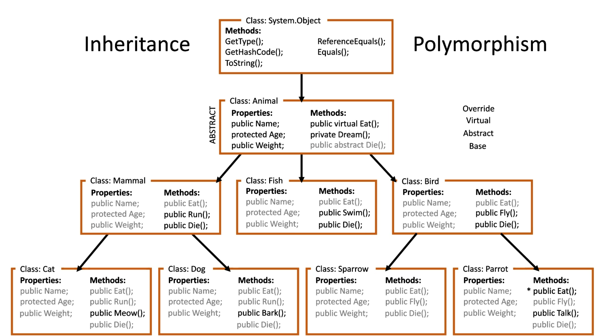

# OOP p3

## Arv (inheritance)
Alla object ärver från System.Object

Alla som ärver är i en " Is a Relationship" t.ex
"Cat and Dog is a Animal"
```C#
Animal animal = new Cat();
object[] animals = new object[]; // allt är object, t.ex int, string. Så detta kan även läggas in i denna arrayn.
// Fungerar perfekt att instanciera.
```


där "*" är, skall det stå override

* Protected är en private som ärvs av de som ärver av super class med en protected field(variabel).

* Override - gör en egen method av en ärvd metod för att ändra den
    *Är statisk polymorphism
    (Overload är dynamisk polymorphism)

* Virtual - sätts på metoder i bas klasser för att visa att man kan overrida en metod.


* Du kan overrida en Property. (Getter/Setter)

* Abstract - Alla som ärver en abstract metod, måste göra egna versioner av metoden. 
* Om jag sätter klassen abstract, så kan jag inte instanciera den klassen. Bara ärva.

* Required - gör så att en field måste sättas. t.ex
    ```
    required public string Name { get; set; }
    ```
    Detta namn måste sättas när man instancerar ett object.


* This - refererar till en variabel / Metod inom klassen.

* Base - refererar till bas klassens variabel/Metod.

* Cast - är att ändra object till en annan. T.ex, från double till int.
    ```C#
    double d = 2.0;
    return (int)d; // returnerar 2
    ```
* Is - Används för att avgöra datatyp t.ex:
    ```C#
        if (animal is Cat)
    {
        Cat myDog = (Cat)animal;
        myDog.Mew();
    }
        else if (animal is Cat cat1) // Denna är den mest optimala då den är kortare 
    {
        cat.Mew();
    }
    ```

* As - Använder en class som en annan class t.ex: Nedan använder animal objectet, som en Dog. Så man kommer åt Dog's Metoder.
    ```C#
    (animal as Dog).Bark();
    ```


## Constructor chaining
Callar this för att skriva mindre kod och sätta varje variabel i varje constructor.

this(firstname)
sätter first name i constructorn med 1 parameter
dvs, this callar constructorn internt


```C#
 class Person
{
class Person
{
    public string FirstName { get; set; }
    public string LastName { get; set; }
    public string Title { get; set; }


    public Person(string firstName, string lastName, string title) : this(firstName, lastName)
    {
        Title = title;
    }
    public Person(string firstName, string lastName) : this(firstName)
    {
        LastName = lastName;
    }

    public Person(string firstName)
    {
        FirstName = firstName;
    }

    
    public Person()
    {

    }
    
}


class Student : Person
{
    public double Grade { get; set; }

    public Student(string firstName, string lastName, string title, double grade) : base(firstName,lastName,title)
    {

    }

}

}
```

Du kan även calla en constructor ur base klassen, med base istället för this.

-------------------------------------

# Polymorphism = override och overload