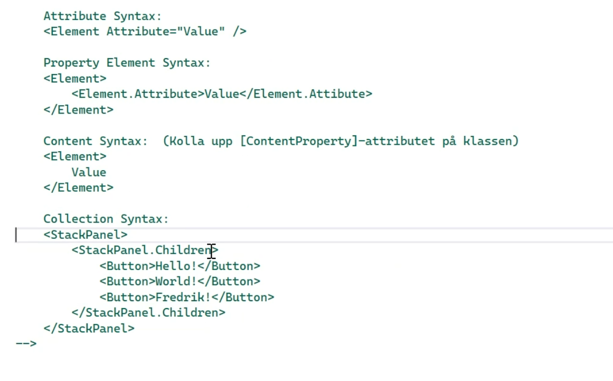

# WPF

## XAML 
* Hyper markup language
```XML
<!-- <Element Attribut>  </Element> -->
<!-- <Open>     </Close> -->

<!--<Button.Content>-->
<!--<Element.Property>-->

<!-- <Button Content="Hello!" /> -->
<!-- <SelfClosingElement" />-->    
```



```XML
<!-- 
    <Element Attribut>  </Element> <= (closing element) 
    <SelfClosingElement />

    Attribute Syntax:
    <Element Attribute="Value" />

    Property Element Syntax:
    <Element>
        <Element.Attribute>Value</Element.Attibute>
    </Element>

    Content Syntax:  (Kolla upp [ContentProperty]-attributet på klassen)
    <Element>
        Value
    </Element>

    Collection Syntax:
    <StackPanel>
        <StackPanel.Children>
            <Button>Hello!</Button>
            <Button>World!</Button>
            <Button>Fredrik!</Button>
        </StackPanel.Children>
    </StackPanel>
-->
 ```
## Förklaring
```XML
<Window x:Class="L047_Intro_WPF.MainWindow"
        xmlns="http://schemas.microsoft.com/winfx/2006/xaml/presentation"
        xmlns:x="http://schemas.microsoft.com/winfx/2006/xaml"
        xmlns:d="http://schemas.microsoft.com/expression/blend/2008"
        xmlns:mc="http://schemas.openxmlformats.org/markup-compatibility/2006"
        xmlns:local="clr-namespace:L047_Intro_WPF"
        mc:Ignorable="d"
        Title="My Application" Height="450" Width="800" FontSize="20"
        >
```

* d = design
* x = xaml
* mc = ignorable
* xmlns = namespaces

## Layout

* Stack panel och grid = för att stacka och sätta elemet på grids.


```XML
<Button x:Name ="button1">
```


