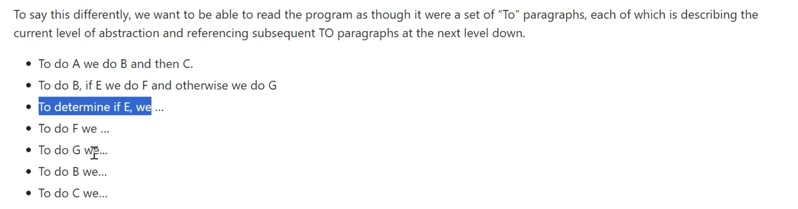

# Clean Code

* Dont repeat yourself. (DRY)
* Tydlig kod, andra skall förstå vad du gör.
* Det skall vara självförklarande.
* Kommentarer bör endast förklara varför, inte hur.

## Namn på variabler, metoder, funktioner, klasser skall vara extremt tydliga. Självförklarande i princip. Lättläst.
    
    * Enhetligt.
    
    * Verb för namn på metoder / funktioner. t.ex GetName(); CalculateAreaForAll
    (Circle[] circles);
    
    * Substantiv för namn på variabler / objekt / class. t.ex Name;
    
    * en variabel, singular. t.ex name;

    * En array / lista / stack (collections), plural. t.ex names;

    * Ej döpa saker till ish samma, t.ex GetName() och GetNames. Unvik namn som är nästan lika.

    * Så korta och beskrivande som möjligt.

    * Namn som går att uttala
    
    * Clarity over entertainment value.

    * Namngivning av bool börjar oftast med is/are/has

### Case
* camelCase - I c# på lokala variabler och parametrar (till metoder/funktioner)
* PascalCase - I C# på allt annat, klasser/funktioner/metoder/properties
* snake_case - I Python 
* kebab-case - Används ej i C#


### Magiska nummer
```C#
int numberOfDays
int numberOfDaysPerWeek = 7;
int numberOfWeeks = 5;
if(numberOfDays / 7 (numberOfDaysPerWeek) <5 (numberOfWeeks))
{

}

```
 * Var tydlig och skriv ner allt i variabler istället för att hårdkoda variabler.


### Funktioner och metoder

 * Namn i verbform, som antyder att något utförs.
 * Funktioner / Metoder bör vara korta men beskrivande.
 * Varje metod gör bara en sak utan bieffekter.
 * Metoder bör helst ta så få parametrar som möjligt.
 
Code should read like a top-down narrative. Every method should be followed by those at the next level of abstraction so that we can read the program, descending one level of abstraction at a time as we read down the list of methods. 


