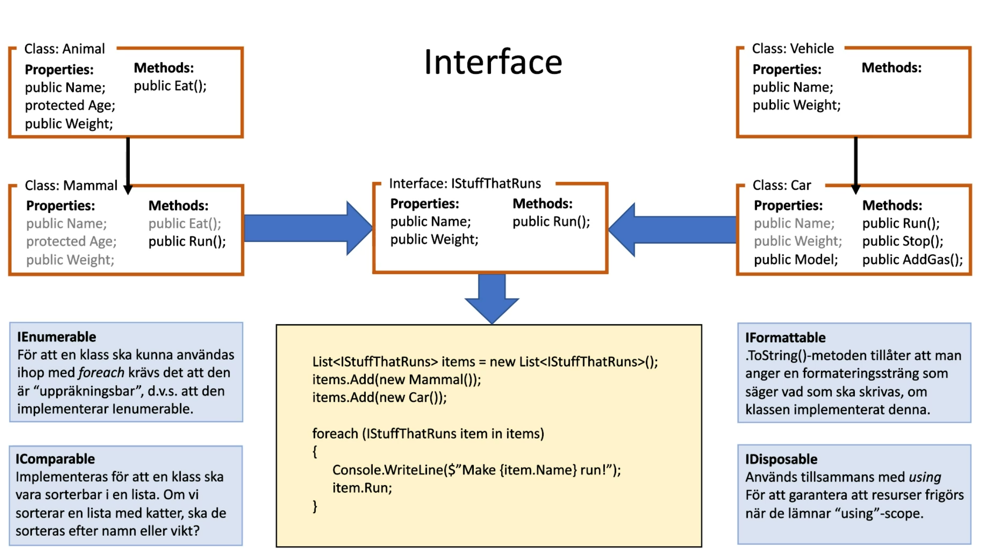

# Interface

* Börjar oftast med ett stort i "IStuffThatRuns","IStuffThatEats"

* Är en Do relationship

* En klass kan ärva endast från en class, men ha flera interfaces.


    ```C#
    class Dog : Animal(Class), IDisposable(Interface),IDog (Interface)
    ```
    

