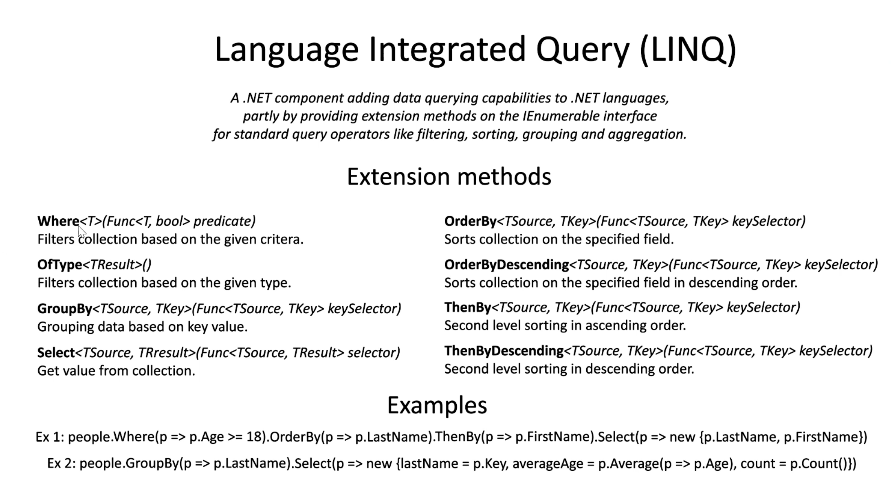
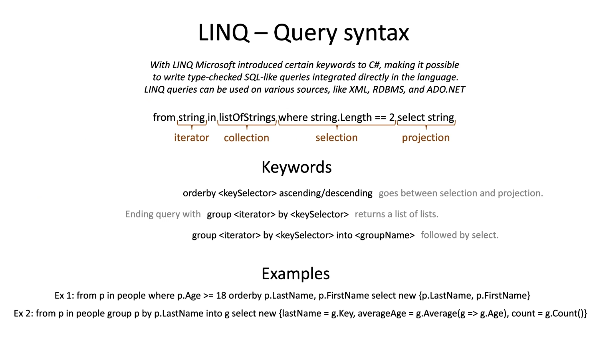
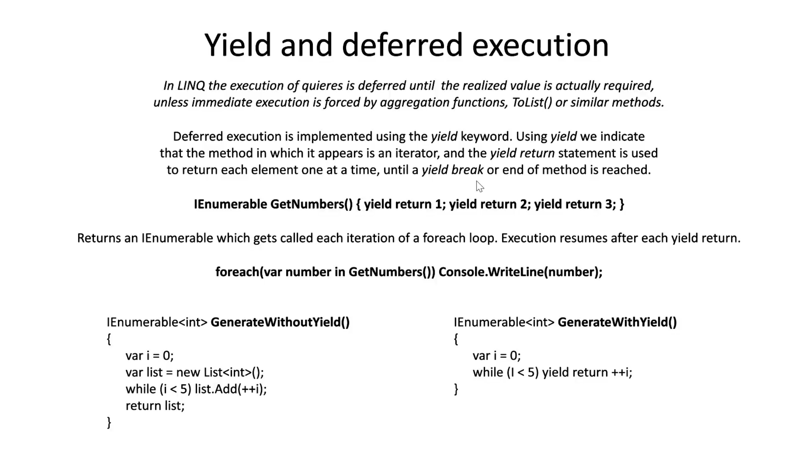

# Linq
Language integrated Query

## Extension methods
Alla dessa går att bygga på varandra. T.ex:
```C#
var people2 = people.Where(p => p.Age >= 40).Select(p => new {FirstName = p.FirstName.Title(), Age = p.Age}).ToList();
```

Koden ovan ger då oss en lista på alla personer som har age över eller lika med 40 med firstName och Age, ej då lastName som finns också.


### Where
* Koden nedan returnerar de string i listan som är 5 i längd. Samtliga.
    ```C#
    var stringList3 = stringList2.Where(s => s.Length == 5).ToList();
    ```

### OfType - (Returnar en IEnumerable)
* ToList (gör IEnumerable till lista)
    ```C#
    List<string> stringList2 = objectList.OfType<string>().ToList();
    ```
* ToArray (gör IEnumerable till array)
    ```C#
    string[] stringList2 = objectList.OfType<string>().ToArray();
    ```
* Var keywordet är det bästa i samband med linq


### GroupBy

### Select 
* Koden nedan returnerar samtliga persons i listan Age. Som en lista.
    ```C#
    var people2 = people.Select(p => p.Age).ToList();
    ```  	


### Any & All
 * koden nedan iterar tekniskt sätt igenom listan som en for loop och kollar om NÅGOT object i listan börjar med B returnerar true eller false
    ```C#
    stringList2.Any(s => s.StartsWith('B'))
    ```

     * koden nedan iterar tekniskt sätt igenom listan som en for loop och kollar om ALLA object i listan börjar med B returnerar true eller false
    ```C#
    stringList2.All(s => s.StartsWith('B'))
    ```

### ForEach
 * ForEach finns i linq också.
    ```C#
    people2.ForEach(p => Console.WriteLine(p.FirstName));
    ```


## SQL Query finns i linq. QUERY SYNTAX


```C#
var query = from p in people where p.Age >= 40 select p; //QUERY SYNTAX
```
Det ovan är samma som det nedan:
```C#
var methodSyntax = people.Where(p => p.Age >= 40).Select(p => p); //Method SYNTAX
```


## IEnumerable
