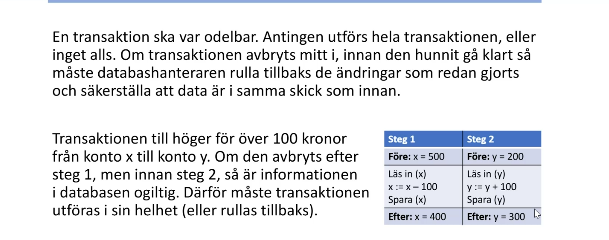
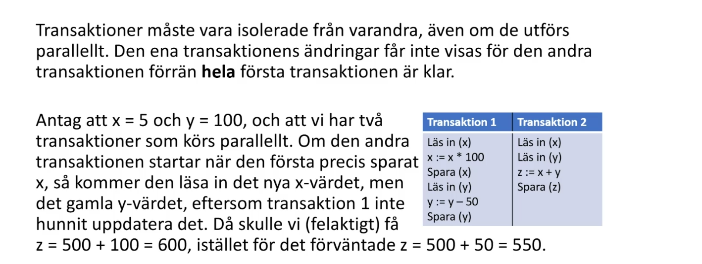
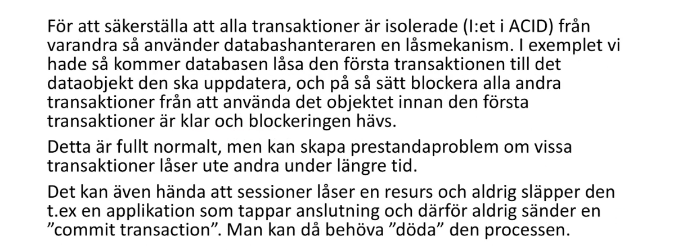
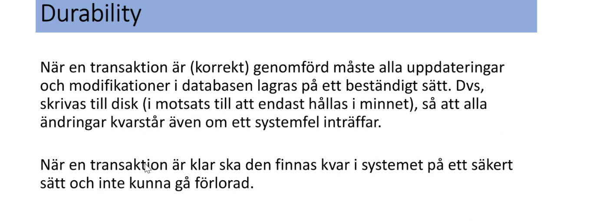
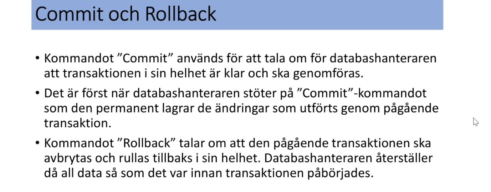
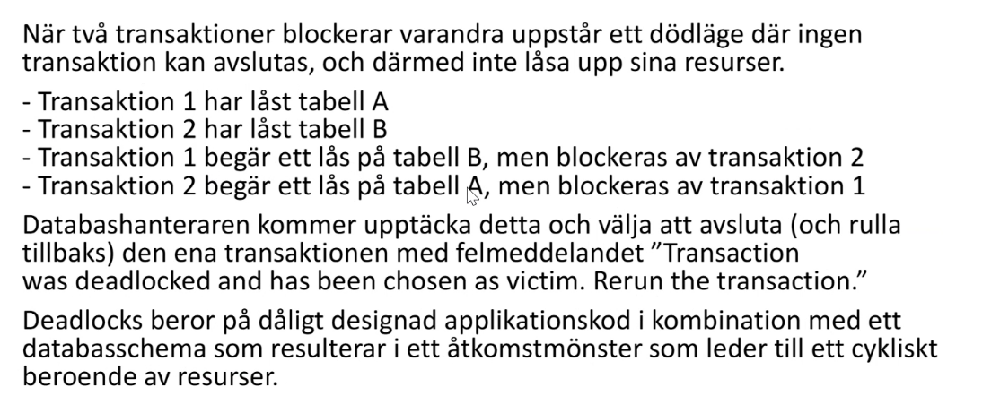

# ACID

## Atomicity

* En transaktion skall vara odelbar

* Antingen utförs allt eller inget alls. (återgår till värde innan om det failar.)




## Consistency

*  Databasen får inte vara motsägelsefull

* Dataintegritet

## Isolation



### Lås och blockeringar



## Durability



## Commit & Rollback



* Kör transaction före update, då kan du kolla på datan innan du spara. Vill du spara, kör commit, vill du inte köra kör rollback.
```sql
 select * from newUsers;


begin transaction
update newUsers set username = '***' where firstname like 'b%'
update newUsers set username = '---' where firstname like 'a%'
commit


rollback
```


## Deadlock

