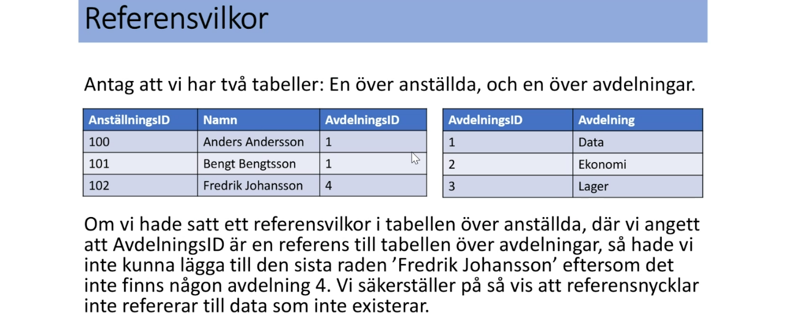
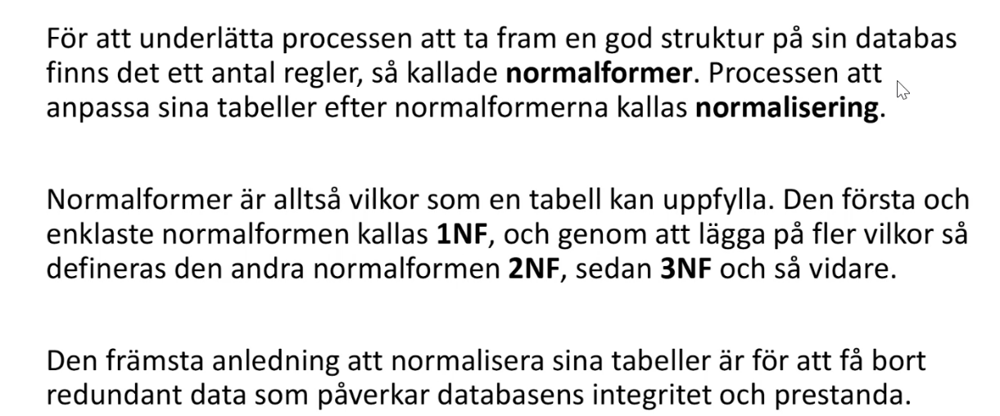
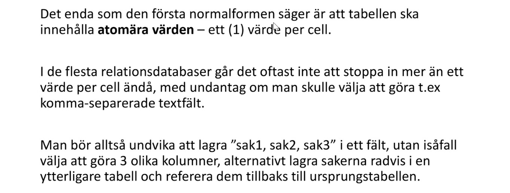
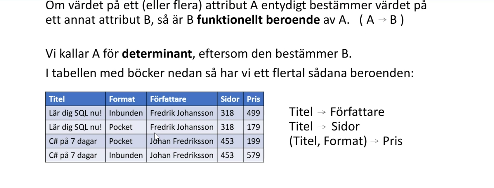
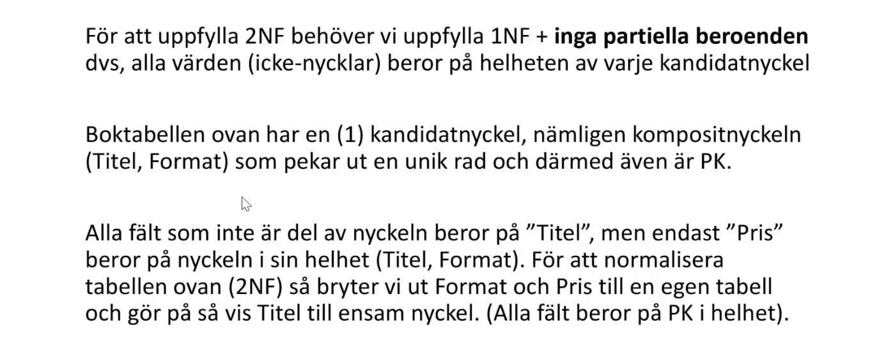
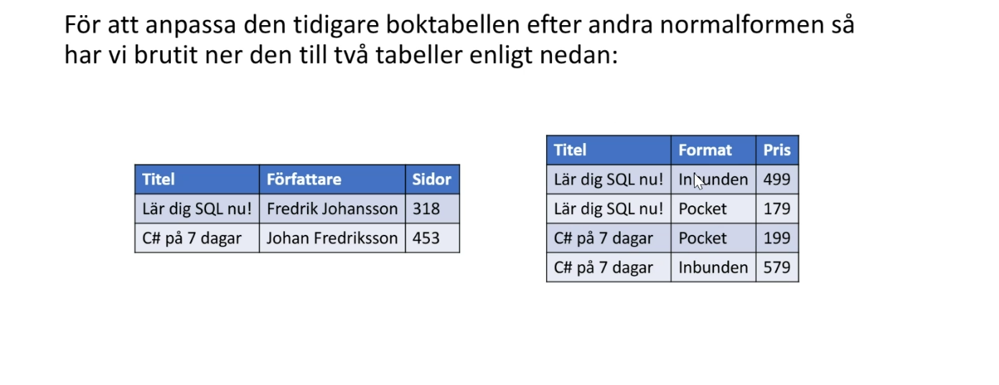
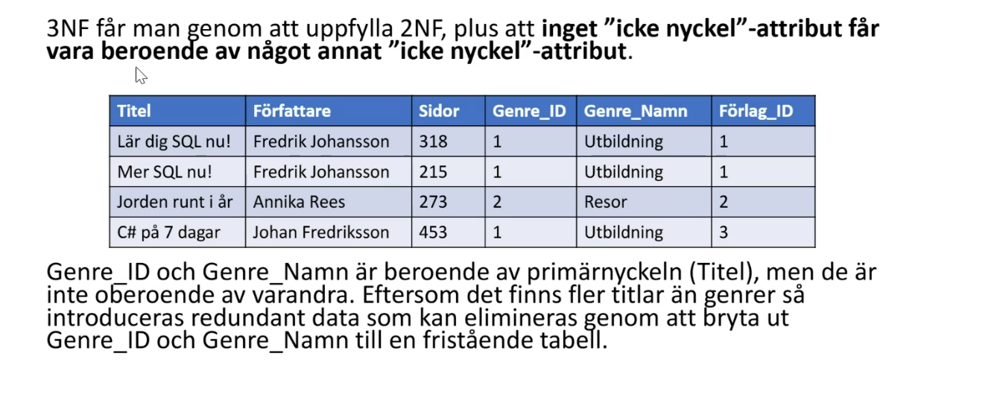
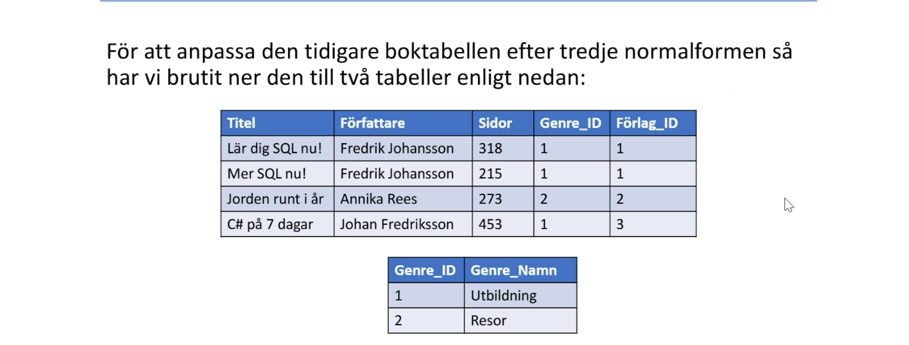

# Dataintegritet

## Constraints, sätt vilkor på datan som lagras.

### Data skall vara korrekt och inte motsägelsefullt. Det skall även inte heller finnas luckor(Null).

* Not NULL, sätt detta värdet så får kolumnen inte innehålla någon null.

* NULL, sätt detta värdet så får kolumnen innehålla null.

* Unique, alla värden i kolumnen måste vara unika. t.ex personnummer. null kan endast ett värde vara som har denna, då null räknas som ett unikt värde. kombinera med Not Null om man vill ha noll null värden.

* primary key, är unique och not null från start. (talar om vilken kolumn i databasen som används för att identifiera en unik kolumn. Den som matchas mot andra tables.)

```SQL
-- 
create table constraintsDemo
(
	id int primary key,
	firstName nvarchar(max) not null,
	SSN nvarchar(100) unique
)
```

* Composite key,(Primary key) Du kan ha en primary key över flera olika kolumner, så kombinationen av de x kolumnerna måste vara unika.
```SQL
-- Du kan även använda design läget i SSMS, högerklicka på ett table.
create table constraintsDemo
(
	id int not null,
	firstName nvarchar(20) not null,
	SSN nvarchar(20) unique not null,
	primary key(id, firstname)
)
```

* Foreign keys, används som en referens mot en annan tabells primary key för att påvisa en relation mellan tabeller.



*Check Condition, 
```SQL
create table constraintsDemo
(
	id int primary key identity(1,1),
	firstname nvarchar(20) check(firstname like 'a%' and len(firstname) = 10),
	personNummer nvarchar(20) check(personnummer like '[0-9][0-9][0-9][0-9][0-9][0-9]-[0-9][0-9][0-9][0-9]')
)
```

* Default, du kan sätta default värde i create.

```SQL
create table constraintsDemo
(
	id int primary key identity(1,1),
	firstname nvarchar(20) default('Fredrik'),
	createdat datetime2 default(getdate())
)
```


* Ta bort primary key
```SQL
alter table x
drop primary key
```

* Identity, sätter auto increment på t.ex id kolumnen som är primary key.

* delete / update rule = cascade: 
(Design, relationships, insert update specs, delete / update rule = cascade, gör så att man kan döpa om saker som är data som är beroende av det. Kan göra det enklare att uppdatera data, men farligt då man kan ta bort mycket fel data. du kan dock sätta no action på delete och endast sätta cascade på update.)

* Sätt ovan setting till set null, gör datan man ändrar etc till null.
 
*  Sätt ovan setting till set default, gör datan man ändrar etc till default valuet.


## Normalisering

### Databas struktur, unvika redundant (upprepad) data. Grundregeln är en typ av sak per tabell och en sådan sak per rad.




första normalformen (1nf)





andra normalformen (2nf)


 Andra normalformen från exemplet innan.



trejde normalformen (3nf)


3nf från exemplet innan.

