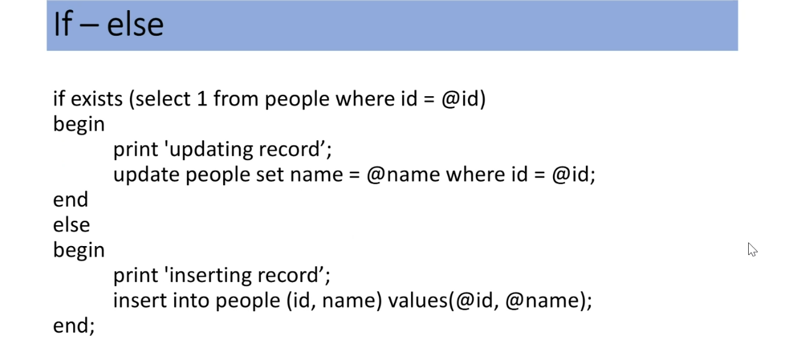
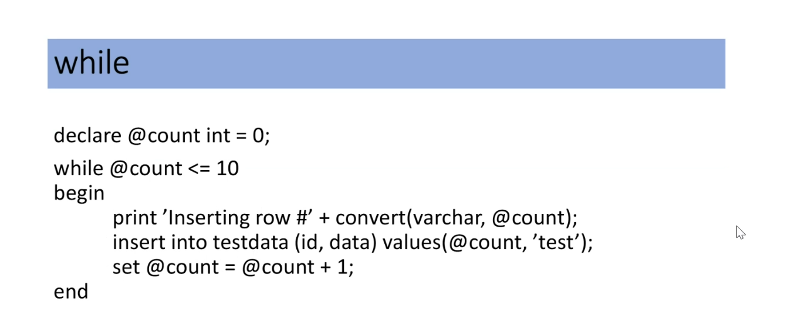

# Setbaserad programmering

* Prodcedual programming, typ av språk som bygger på att funktioner exekveras i en given ordningsföljd, en efter en. ( Går att använda i T-SQL inte den bästa lösningen)

* Set-Based programming, Konstruerat för att behanlda ett helt set av data åt gången.

